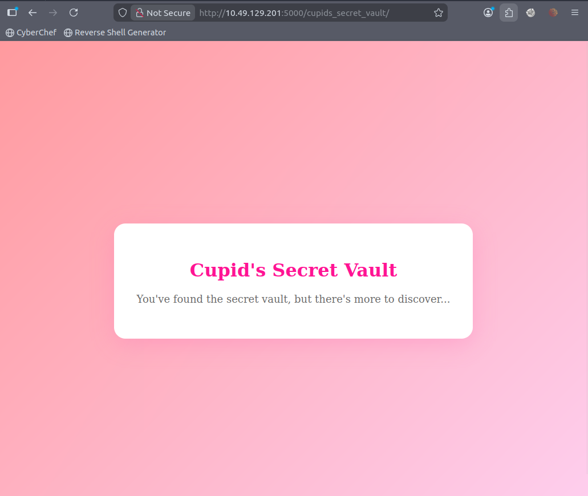

# 💘 Cupid’s Secret Vault – CTF Walkthrough

> Target: `http://10.49.129.201:5000`
> Category: Web
> Difficulty: Easy–Medium
> Flag: `THM{l0v3_is_in_th3_r0b0ts_txt}`

---

## 🧭 Initial Reconnaissance

Upon visiting the target:

```
http://10.49.129.201:5000
```

We are greeted with a simple landing page titled:

> **Love Letters Anonymous**

### 🖼 Landing Page


The page contains no forms, no JavaScript, and no visible functionality — suggesting that the real application is hidden elsewhere.

---

## 🔎 Checking robots.txt

As part of standard web enumeration, we checked:

```
http://10.49.129.201:5000/robots.txt
```

### 🖼 robots.txt


Contents:

```
User-agent: *
Disallow: /cupids_secret_vault/*

# cupid_arrow_2026!!!
```

### 🚨 Key Findings

1. Hidden directory:

   ```
   /cupids_secret_vault/
   ```

2. Commented string:

   ```
   cupid_arrow_2026!!!
   ```

This immediately suggests:

* A hidden route exists
* The comment may contain credentials

---

## 🏛 Accessing the Secret Vault

Navigating to:

```
http://10.49.129.201:5000/cupids_secret_vault/
```

### 🖼 Vault Landing Page



The page states:

> "You've found the secret vault, but there's more to discover..."

This implies further enumeration is required.

---

## 🔐 Discovering the Admin Login

By appending common administrative paths:

```
/cupids_secret_vault/administrator
```

We discover an admin login panel.

### 🖼 Admin Login Page


---

## 🧠 Credential Discovery

From `robots.txt`, we previously found:

```
cupid_arrow_2026!!!
```

Given its suspicious placement in a comment, we attempt login with:

**Username:**

```
admin
```

**Password:**

```
cupid_arrow_2026!!!
```

---

## 🎉 Successful Login

The credentials work, granting access to the vault and revealing the flag.

---

## 🏁 Flag

```
THM{l0v3_is_in_th3_r0b0ts_txt}
```
