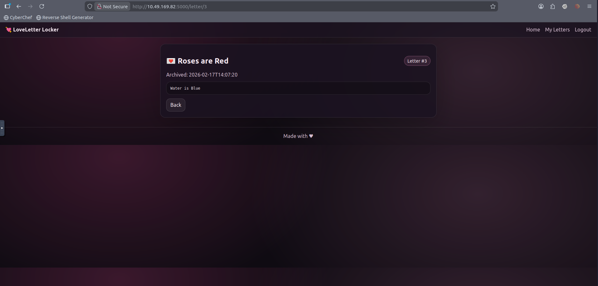
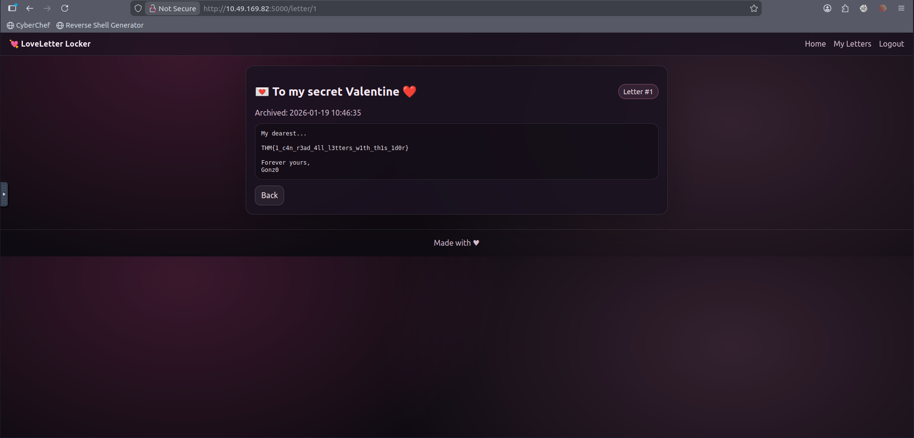

# 💌 LoverLetterLocker – IDOR Exploitation Walkthrough

> **Target:** LoverLetterLocker Web Application
> **Category:** Web
> **Objective:** Exploit broken access control to retrieve the hidden flag

---

# 🧭 Challenge Overview

LoverLetterLocker is a web application that allows users to:

* 💖 Create romantic letters
* 📦 Store them in a personal archive
* 🔒 Keep them private

The description hints:

> *“For your eyes only?”*

This subtle phrasing suggests that privacy might not be properly enforced.

---

# 🧠 Understanding the Attack Surface

After registering and logging in, we observe:

* A dashboard showing personal letters
* A global letter archive count
* Letters assigned numeric identifiers
* URL structure exposing letter IDs

This immediately raises suspicion of:

**Insecure Direct Object Reference (IDOR)**

---

# 🔍 Step 1 – Initial Access

We register a new account and log in.

After authentication, we are redirected to:

```
/letters
```

### Dashboard View

The page displays:

* “Total letters in Cupid’s archive: 2”
* “No letters yet.”

📌 Important observation:
There are already **2 letters in the system**, even though our account is new.

.png)

---

# 🔍 Step 2 – Creating a Letter

We create a new letter:

* **Title:** Roses are Red
* **Content:** Water is Blue

After submission, we are redirected to:

```
/letter/3
```

### Created Letter View



### Key Observation

* The letter is accessible via a numeric ID.
* Our letter received ID **3**.
* Since 2 letters existed before, IDs 1 and 2 must belong to other users.

This strongly suggests sequential ID assignment.

---

# 🎯 Step 3 – Testing for IDOR

We manually modify the URL:

```
/letter/1
```

Instead of receiving an authorization error, the application loads the letter successfully.

### Flag Retrieved


```
THM{1_c4n_r3ad_4ll_l3tters_w1th_th1s_1d0r}
```

This confirms the vulnerability.

---

# 🔓 Root Cause Analysis

The backend likely retrieves letters using logic similar to:

```python
letter = Letter.query.get(letter_id)
```

However, secure implementation should enforce ownership validation:

```python
letter = Letter.query.filter_by(
    id=letter_id,
    user_id=current_user.id
).first()
```

Because the server does **not** verify that the requesting user owns the letter:

* Any authenticated user can enumerate IDs.
* Any letter can be accessed.
* Privacy is completely broken.

This is a classic **Broken Access Control** issue.

---
